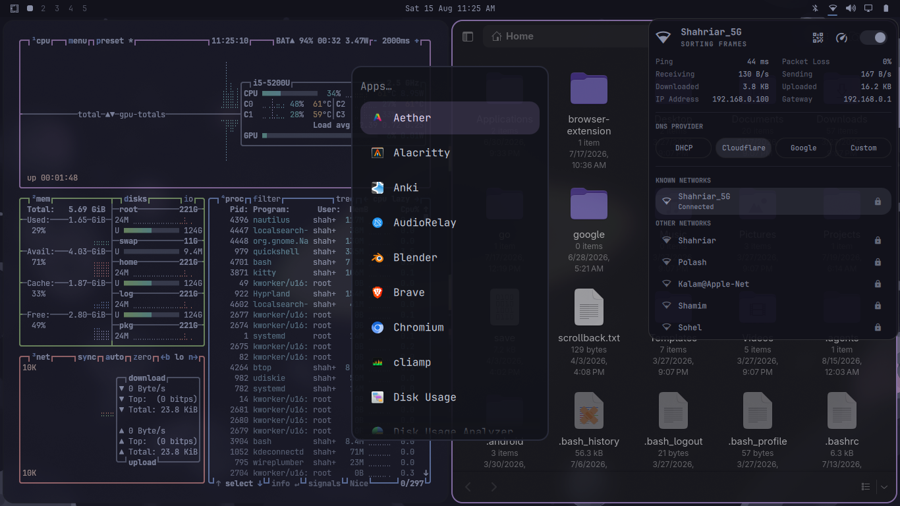

## 🖥️ Preview

<p align="center">
  <a href="https://github.com/Shavanced/ame-quattro/blob/main/video-preview.mp4">
    
  </a>
</p>

<p align="center">
  <sub>▶ Click the preview to watch the AME theme video.</sub>
</p>


## 📦 Installation

### Omarchy

The easiest way to install AME is with Omarchy's built-in theme installer:

```bash
omarchy-theme-install https://github.com/Shavanced/ame-quattro.git
```

After installation, select **AME** from your available themes.

This theme is inspired from rainy night omarchy theme.
